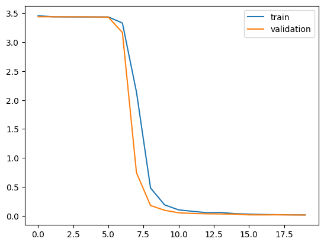

# CAPTCHA Recognition using CNN + BiLSTM + Attention

## Overview

This project focuses on automatic recognition of 6-character CAPTCHA images using Deep Learning. The objective is to predict the complete CAPTCHA sequence directly from the image without explicit character segmentation.

The final model combines:

- Convolutional Neural Networks (CNN) for feature extraction
- Bidirectional Long Short-Term Memory (BiLSTM) networks for sequence learning
- Self-Attention mechanism for capturing contextual relationships
- TimeDistributed Dense layer for character prediction

The model achieved a Character Error Rate (CER) of **0.0035**, demonstrating highly accurate CAPTCHA recognition.

---

## Dataset

The dataset consists of CAPTCHA images containing six alphanumeric characters.

### Character Set

```text
A-Z
0-9
```

Total classes:

```text
36 characters + 1 padding/blank class = 37 classes
```

### Image Processing

Each image was:

1. Loaded in grayscale format
2. Resized to 200 × 50 pixels
3. Normalized to the range [0,1]
4. Expanded to include a channel dimension

Final image shape:

```text
(50, 200, 1)
```

---

## Label Processing

The labels were cleaned and encoded before training.

### Label Cleaning

Only uppercase alphanumeric characters were retained.

Only labels of length 6 were retained.

### Label Encoding

Each character was converted into a numerical representation using LabelEncoder.

Example:

```text
ABC123

↓

[10,11,12,1,2,3]
```

---


# Model Architecture

The final architecture combines CNNs, BiLSTMs and an Attention mechanism.

## Architecture Summary

```text
Input Image

↓

CNN Feature Extraction

↓

Reshape to Sequence

↓

BiLSTM

↓

Attention

↓

BiLSTM

↓

Dense Layer

↓

Sequence Compression

↓

TimeDistributed Classification

↓

Predicted CAPTCHA
```

---

## Layer Details

### Input Layer

```text
Input Shape:
(50, 200, 1)
```

---

### CNN Feature Extraction

#### Convolution Block 1

```text
Conv2D(32)

↓

MaxPooling2D
```

Output:

```text
(25,100,32)
```

---

#### Convolution Block 2

```text
Conv2D(64)

↓

MaxPooling2D
```

Output:

```text
(12,50,64)
```

---

#### Convolution Block 3

```text
Conv2D(128)

↓

BatchNormalization
```

Output:

```text
(12,50,128)
```

---

## Sequence Conversion

The CNN feature map is transformed into a sequence representation.

```text
(12,50,128)

↓

Reshape

↓

(600,128)
```

Each timestep represents a learned visual feature from the image.

---

## First BiLSTM Layer

```text
Bidirectional LSTM

128 units
```

Output:

```text
(600,256)
```

Purpose:

- Capture left-to-right context
- Capture right-to-left context
- Learn sequential dependencies

---

## Attention Layer

The Attention layer enables the model to focus on important regions of the sequence while predicting characters.

```text
BiLSTM Output

↓

Self-Attention

↓

Context-Aware Features
```

Output:

```text
(600,256)
```

---

## Concatenation

The original BiLSTM features and attention features are combined.

```text
BiLSTM Features

+

Attention Features

↓

Concatenate
```

Output:

```text
(600,512)
```

---

## Second BiLSTM Layer

```text
Bidirectional LSTM

128 units
```

Output:

```text
(600,256)
```

This layer further refines sequence understanding using both local and global contextual information.

---

## Dense Layer

```text
Dense(128)
```

Output:

```text
(600,128)
```

---

## Sequence Compression

The sequence is compressed to six positions.

```text
(600,128)

↓

Lambda Layer

↓

(6,128)
```

Since every CAPTCHA contains six characters, only the first six sequence positions are retained.

---

## Character Prediction Layer

```text
TimeDistributed Dense(37)
```

Output:

```text
(6,37)
```

Each of the six positions predicts probabilities across 37 classes.

---

## Model Statistics

| Metric | Value |
|----------|----------|
| Total Parameters | 1,050,405 |
| Trainable Parameters | 1,050,149 |
| Non-Trainable Parameters | 256 |

---

# Training Configuration

### Optimizer

```text
Adam
```

### Learning Rate

```text
0.0001
```

### Loss Function

```text
Sparse Categorical Crossentropy
```

### Batch Size

```text
32
```

### Epochs

```text
20
```

---

# Training Performance

The training and validation losses were monitored throughout training.

## Loss Curve

Add the loss curve image to the repository and reference it as:




### Training Analysis

The loss curve demonstrates:

- Stable convergence
- Similar training and validation trends
- No significant divergence between curves
- Effective learning after initial epochs
- Strong generalization capability

The close alignment between training and validation losses indicates that the model does not suffer from noticeable overfitting.

---

# Evaluation Metric

## Character Error Rate (CER)

Character Error Rate measures prediction errors at the character level.

### Formula

```text
CER =
(Number of Insertions + Deletions + Substitutions) / Total Characters
```

Lower CER values indicate better recognition performance.

---

# Results

| Metric | Value |
|----------|----------|
| Character Error Rate (CER) | **0.0035** |
| Training Epochs | 20 |
| Batch Size | 32 |
| Input Size | 50 × 200 |
| Output Classes | 37 |
| Architecture | CNN + BiLSTM + Attention |

---

## Interpretation

A CER of:

```text
0.0035
```

means only:

```text
0.35%
```

of characters were predicted incorrectly.

This corresponds to approximately:

```text
99.65% character-level accuracy
```

demonstrating highly accurate CAPTCHA recognition.

---

# Sample Prediction Workflow

```text
Input CAPTCHA Image

↓

CNN Feature Extraction

↓

Sequence Representation

↓

BiLSTM

↓

Attention

↓

BiLSTM

↓

Character Prediction

↓

Predicted CAPTCHA Text
```

---

# Conclusion

A CNN-BiLSTM-Attention architecture was developed for CAPTCHA recognition. The CNN layers successfully extracted visual features, the BiLSTM layers captured sequential dependencies, and the Attention mechanism enabled the model to focus on important regions of the sequence.

The final model achieved a Character Error Rate of **0.0035**, corresponding to approximately **99.65% character-level accuracy**, demonstrating excellent performance and strong generalization on unseen CAPTCHA images.
